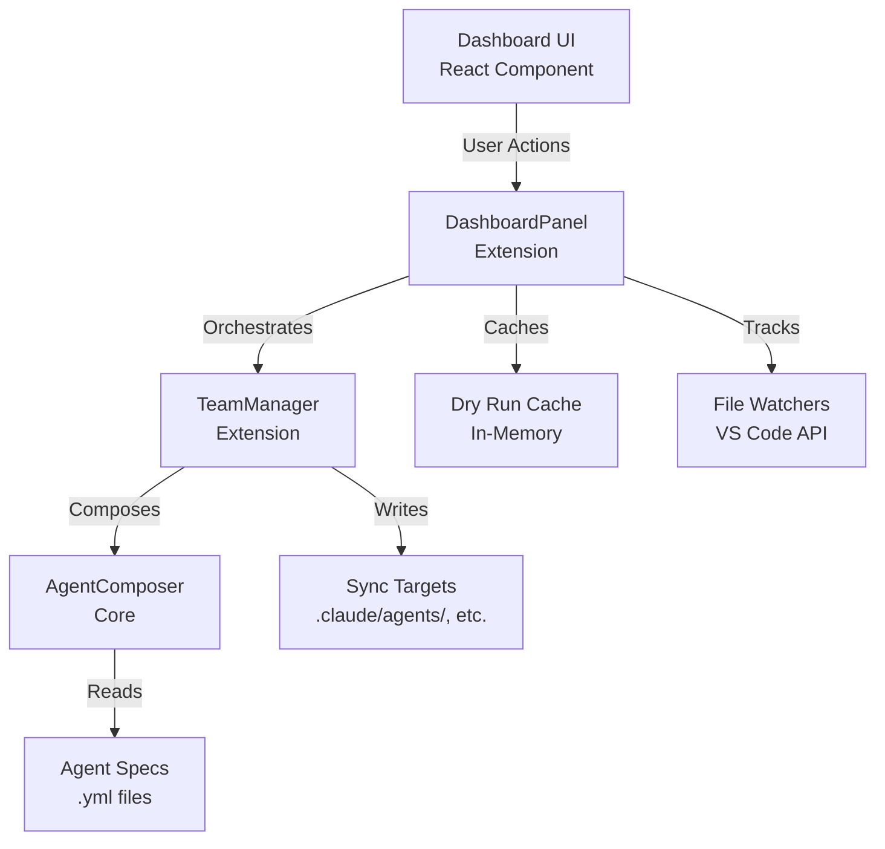
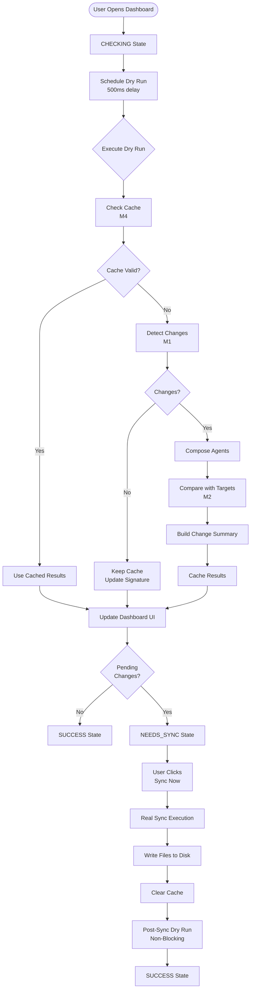
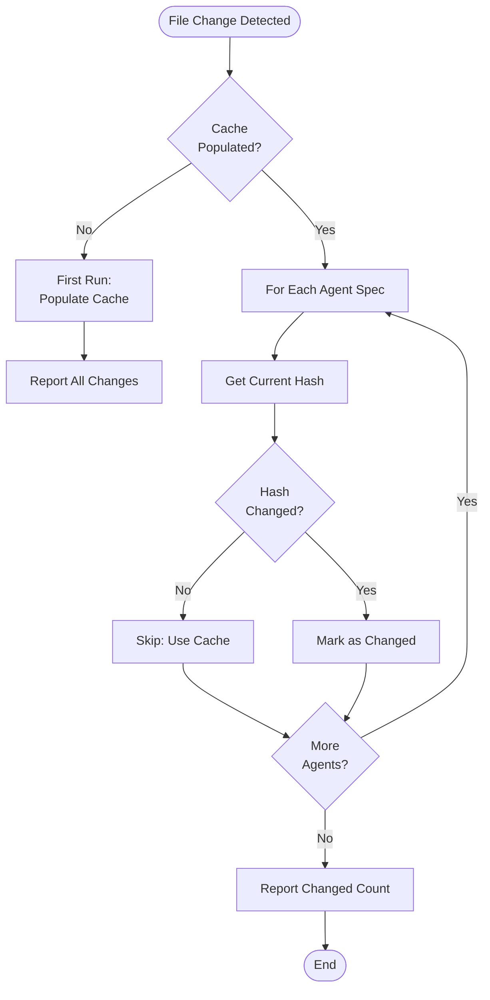
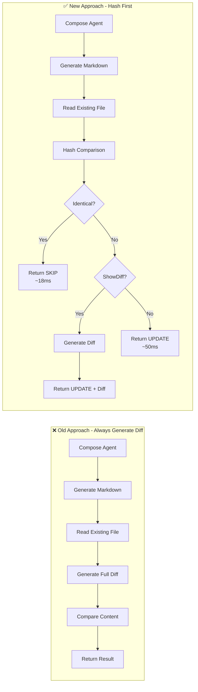
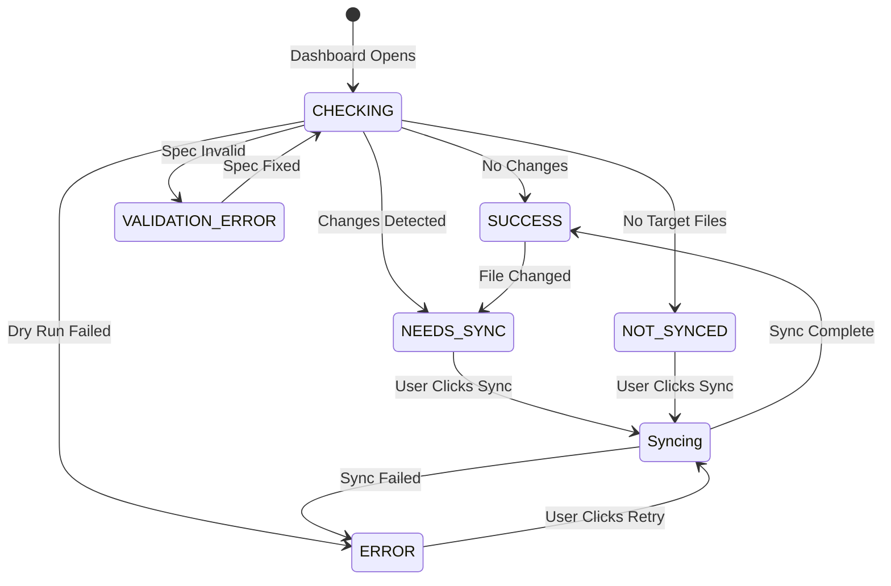

# Sync System Documentation - Image Manifest

This file lists all images referenced in `sync-system.md`. Create these diagrams and place them in `docs/images/`.

## Required Images

### Architecture Diagrams

#### `sync-architecture.png`
High-level architecture diagram showing the sync system components and their relationships.

**Elements:**
- Dashboard UI (top layer) - user interface
- DashboardPanel (extension layer) - state management
- TeamManager (extension layer) - sync operations
- AgentComposer (core layer) - spec composition
- Disk/Filesystem (bottom layer) - target files
- Arrows showing data flow between components

**Suggested Tool:** draw.io, Excalidraw, or Mermaid

**Mermaid Code:**


---

#### `sync-flow.png`
Complete sync lifecycle flowchart from dashboard open to sync complete.

**Elements:**
- Start: User opens dashboard
- CHECKING state box
- Dry run execution (detailed steps)
- Decision diamond: Changes detected?
- NEEDS_SYNC / SUCCESS state boxes
- User action: Click "Sync Now"
- Real sync execution (detailed steps)
- Post-sync dry run
- Final SUCCESS state
- Error paths (validation error, sync error)

**Mermaid Code:**


---

### Optimization Diagrams

#### `m1-incremental-detection.png`
Flowchart showing M1 incremental detection logic with hash comparison and cache hit/miss paths.

**Elements:**
- Start: File change detected
- Check: Cache populated?
- First run path: Populate cache, report changes
- Hash comparison loop for each agent
- Cache hit: Skip composition
- Cache miss: Re-compose agent
- End: Report changed agents count

**Mermaid Code:**


---

#### `m2-lazy-diff.png`
Comparison diagram showing old approach (always generate diff) vs new (hash first, diff only if requested).

**Elements:**
- Side-by-side comparison:
  - **OLD (Slow):** Generate markdown → Generate diff → Compare content → Return result
  - **NEW (Fast):** Generate markdown → Hash comparison → Skip if identical → Generate diff only if showDiff=true

**Mermaid Code:**


---

#### `m3-smart-invalidation.png`
Before/after diagram showing full cache clear vs selective invalidation when one agent changes.

**Elements:**
- **BEFORE:** Single agent spec change → Clear entire cache → Re-compose all 8 agents
- **AFTER:** Single agent spec change → Invalidate only that agent's hash → Re-compose only 1 agent

**Visual Suggestion:** 
Show 8 agent boxes. On change:
- Before: All 8 boxes turn red (invalidated), all get re-composed
- After: Only 1 box turns red, only that one gets re-composed

---

### UI State Screenshots

These should be actual screenshots from the extension running in VS Code.

#### `sync-ui-states.png`
State machine diagram showing all sync states and transitions.

**Mermaid Code:**


---

#### `state-checking.png`
Screenshot of dashboard in CHECKING state.

**What to show:**
- Sync status card with blue background
- Loader2 icon (spinning)
- Title: "Checking for changes"
- Description: "Verifying current sync status..."
- No sync button visible
- Badge: "Checking..."

---

#### `state-success.png`
Screenshot of dashboard in SUCCESS state.

**What to show:**
- Sync status card with green background
- CheckCircle2 icon
- Title: "Up to date"
- Description: "Last synced just now" (or time ago)
- Badge: Shows last sync time
- No sync button (nothing to sync)

---

#### `state-needs-sync.png`
Screenshot of dashboard in NEEDS_SYNC state with expanded change list.

**What to show:**
- Sync status card with yellow/amber background
- ArrowDownUp icon
- Title: "Sync needed"
- Badge: "8 pending"
- Description: "8 updated — changes pending sync"
- Expanded list showing:
  - • claude_code/test-frontend (modified)
  - • github_copilot/router (modified)
  - • ... more agents
- Eye icon button to toggle details
- "Sync Now" button (yellow/amber, enabled)

---

#### `state-error.png`
Screenshot of dashboard in ERROR state.

**What to show:**
- Sync status card with red background
- AlertTriangle icon
- Title: "Sync failed"
- Description: "Last sync encountered an error"
- Error message shown (e.g., "EACCES: permission denied")
- "Retry Sync" button (red/destructive)

---

#### `state-validation-error.png`
Screenshot of dashboard in VALIDATION_ERROR state.

**What to show:**
- Sync status card with red background
- AlertTriangle icon
- Title: "Validation error"
- Badge: "1 agent"
- Description: "Fix the validation error below before syncing"
- Inline error block showing:
  - Failed agent: `test-frontend`
  - Error message: "Missing required field 'description'"
- **NO sync button** (not actionable)

---

## Creating the Images

### Tools Recommended

1. **Diagrams/Flowcharts:** 
   - [Mermaid Live Editor](https://mermaid.live/) - Use the provided Mermaid code above
   - [draw.io](https://app.diagrams.net/) - Free, web-based
   - [Excalidraw](https://excalidraw.com/) - Hand-drawn style

2. **Screenshots:**
   - VS Code extension running locally
   - Ensure high resolution (at least 1920px wide)
   - Crop to show only relevant UI (sync status card area)
   - Annotate with arrows/labels if needed

3. **Export Settings:**
   - Format: PNG
   - Resolution: 2x or higher for Retina displays
   - Compression: Optimize with ImageOptim or similar

---

## Adding Images to Sync Targets

To ensure images sync to documentation sites, add this directory to `project.profile.yml`:

```yaml
paths:
  docs_images: docs/images
```

And update sync configuration to include image files in relevant targets.

---

## Checklist

- [ ] `sync-architecture.png` - Architecture diagram
- [ ] `sync-flow.png` - Complete sync flow
- [ ] `m1-incremental-detection.png` - M1 optimization
- [ ] `m2-lazy-diff.png` - M2 optimization comparison
- [ ] `m3-smart-invalidation.png` - M3 before/after
- [ ] `sync-ui-states.png` - State machine diagram
- [ ] `state-checking.png` - CHECKING state screenshot
- [ ] `state-success.png` - SUCCESS state screenshot
- [ ] `state-needs-sync.png` - NEEDS_SYNC with list expanded
- [ ] `state-error.png` - ERROR state screenshot
- [ ] `state-validation-error.png` - VALIDATION_ERROR screenshot

---

*Note: This manifest should be updated whenever new images are added to sync-system.md*
